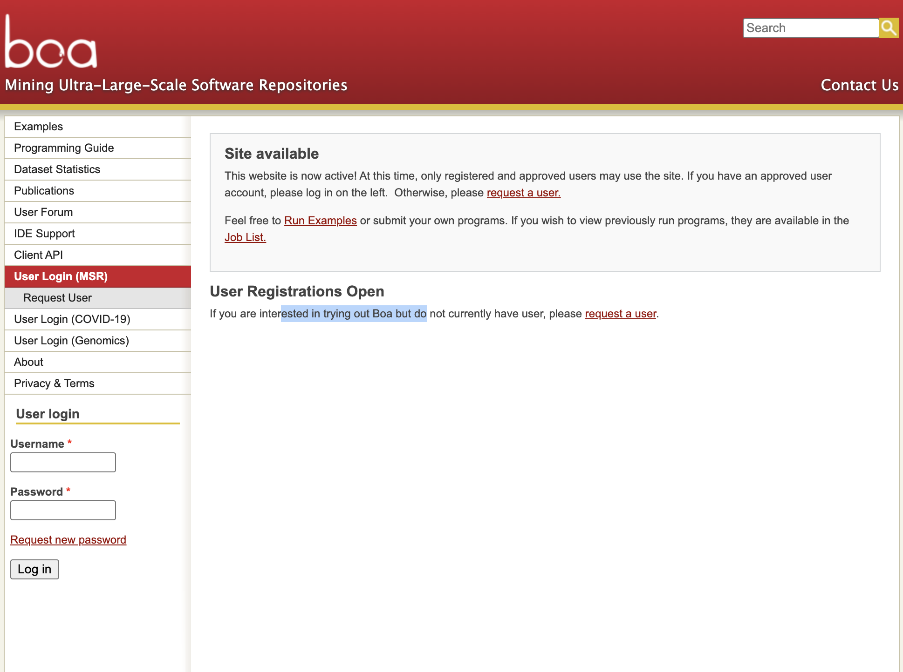
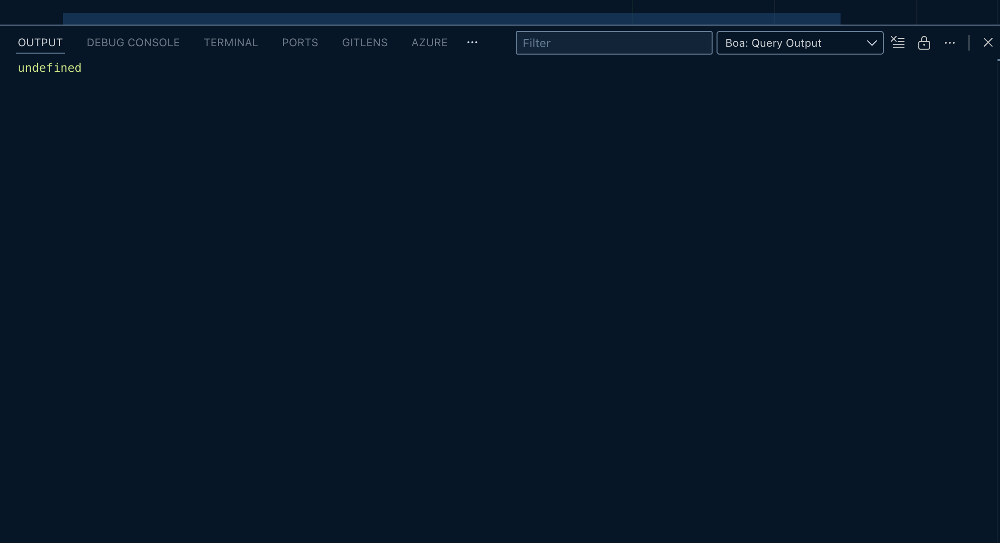
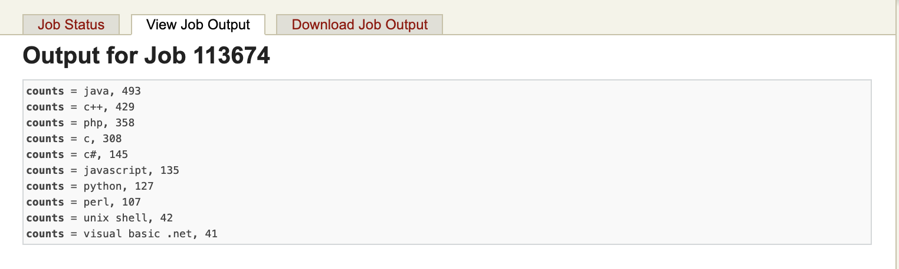

# Work Log

## Task 1: Account Setup and Registration

### Boa Platform Registration

I began my task by registering for an account on the Boa platform. Boa is a powerful tool for mining software repositories and analyzing source code at scale. From their website, I learned that users must register and be approved before they can access the platform.

#### Registration Process

1. **Initial Access**: I navigated to the Boa website at <https://boa.cs.iastate.edu/boa/>
2. **Account Creation**: Since the platform requires registration and approval before use, I completed the user registration form
3. **Confirmation**: Successfully submitted my registration request and received confirmation within one business day.

#### Screenshots of Registration Process

**Registration Page:**


**Login Page (Post-Registration):**



#### What I have tried in the meantime

As I await for my account approval, I tried to install and set up Boa locally. There is not much documentation on how to do this, but I found this github repository:

- [Boa docker](https://github.com/boalang/boa-docker.git)
- [Boa compiler](https://github.com/boalang/compiler.git)

The boa docker image was not working for me, The documentation was outdated and only ran on Arm architecture. I tried to build the image on both my M2 macbook air (arm platform) and and Ubuntu 22.04 (x86_64 platform) but I was not able to make it work.

Main issues I faced:

- On the M2 macbook air, the docker build failed because some of the install command on the dockerfile, the PPA was renamed. I tried to fix it but then I faced other issues with the dependencies. Like It was trying to copy some files from my `/usr/lib` folder to the docker image but those files did not exist on my machine.

- On the Ubuntu machine, the docker build was not successful because I could not run arm images on an x86_64 machine. I tried to use `--platform=linux/arm64/v8` flag but then I faced other issues with the dependencies.

## Task 2: Reviewing Boa Documentation and Examples

After I got my access to the Boa platform, I started reviewing the exampls and documentation available at [https://boa.cs.iastate.edu/examples/index.php](https://boa.cs.iastate.edu/examples/index.php). and I tried to run those examples on my local machine. During this process, I discovered that there is a boa extension for VSCode that makes it easier to write and run boa scripts. I installed the extension and tried to run some of the examples provided in the documentation. I tried to run the most programming language example that is available in the documentation (first example available in the documentation). Using the vs code extension, I was able to run the example but when getting results using the extension, I faced problem the output was showing `undefined`. The output was okay but not showing in the extension output window. I had to check the output files generated in the platform to see the results.
See screenshot below:



## Task 3: Creating Dataset of Control Flows with Known Vulnerabilities

### Subtask 3.1: Identifying Bug-Fix Commits

Written a Boa script to identify commits that indicate bug fixes using keywords such as "bug", "fix", "patch", "issue", "error", "vulnerability", "security", "CVE", "buffer", "injection", "npe", and "overflow". The script iterates over all commits in the Boa dataset and checks if the commit message contains any of the specified keywords. If a match is found, it outputs the project URL, commit URL, and commit message.

### Subtask 3.2: Extracting Control Flow Graphs (CFGs) from Bug-Fix Commits

Developed a Boa script to extract Control Flow Graphs (CFGs) from the source code associated with the identified bug-fix commits. The portion of the script responsible for CFG extraction is shown below:

```sh
if (is_fix_commit) {
      # 5. If it's a fixing commit, iterate over the changed files to analyze methods
      
      # Use a visitor pattern to traverse the contents of the commit
      visit(commit, visitor {
          # Target nodes of type ChangedFile [5, 9]
          before file: ChangedFile -> {
              # Get the Abstract Syntax Tree (AST) for the file [10]
              ast: ASTRoot = getast(file);
              
              # Traverse the AST to find Method declarations
              visit(ast, visitor {
                  # Target nodes of type Method [9, 11]
                  before m: Method -> {
                      # 6. Generate the Control Flow Graph (CFG) for the method [3]
                      cfg: CFG = getcfg(m);
                      
                      # 7. Serialize the CFG into Graphviz DOT string format [2]
                      # This string represents the nodes and edges (as required for the dataset)
                      cfg_dot: string = dot(cfg, true);

                      cfg_dot = strreplace(cfg_dot, "\n", " ", true); # Clean new lines for output [8]
                      cfg_dot = strreplace(cfg_dot, "\r", " ", true); # Clean carriage returns for output [8]
                      
                      # 8. Output the required data, comma separated
                      output_line: string = project_url + " , " + commit_url + " , " + msg_clean + " , " + cfg_dot;
                      fix_cfgs << output_line;
                  }
              });
              
              # Stop traversing the Revision object's children once the file's contents are handled, 
              # allowing the visitor to move to the next ChangedFile in the list.
              stop; # [12]
          }
      });
  }
}
```

This script processes each bug-fix commit, traverses the changed files, and generates the CFG for each method in the files. The CFG is serialized into Graphviz DOT format for easy representation of nodes and edges.

### Subtask 3.3: Extracting The CFG of the Previous Version of the Fixed Method

In this step, I enhanced the previous Boa script to also extract the CFG of the method from the commit prior to the bug-fix commit. This allows for a comparative analysis between the buggy version and the fixed version of the method. The script retrieves the parent commit of the bug-fix commit, accesses the changed files in that commit, and generates the CFG for the corresponding method. The file for this checkpoint is located at `analysis/fix-commit-with-previous-cfg.boa`.

### Subtask 3.4: Dataset Compilation

After the data is processed, I needed to download the output files. The output file that generated on the dataset `2019 October/GitHub (small)` is around 1 GB in size. To download the output file, I tried using the Boa platform's web interface, but it was hard due to large data size. So I used the Boa's python api to download the output file programmatically. Below is a sample code snippet that demonstrates how to download the output file using the Boa Python API:

```python
import getpass
import time

from boaapi.boa_client import BOA_API_ENDPOINT, BoaClient
from boaapi.status import CompilerStatus, ExecutionStatus

client = BoaClient(endpoint=BOA_API_ENDPOINT)
user = input("Username [%s]: " % getpass.getuser())
if not user:
    user = getpass.getuser()
client.login(user, getpass.getpass())
print('successfully logged in to Boa API')

# get the last job
job = client.last_job();

if job.is_running() is False and job.exec_status == ExecutionStatus.FINISHED:
    print('Job is not running and finished successfully. Downloading output...')
    output = job.output()
    with open('output.txt', 'w') as f:
        f.write(output)
    print('Output written to output.txt')
else:
    print('Job is still running. Please wait until it finishes.')
```

This script was getting this following error: 

```sh
 python analysis/output-downloader.py
Username [akib]: 
Password: 
successfully logged in to Boa API
Job is not running and finished successfully. Downloading output...
Traceback (most recent call last):
  File "/Users/akib/Developer/phd-recruitment-task/analysis/output-downloader.py", line 19, in <module>
    output = job.output()
  File "/Users/akib/.pyenv/versions/boa-client/lib/python3.13/site-packages/boaapi/job_handle.py", line 91, in output
    return self.client._output(self)
           ~~~~~~~~~~~~~~~~~~~^^^^^^
  File "/Users/akib/.pyenv/versions/boa-client/lib/python3.13/site-packages/boaapi/boa_client.py", line 403, in _output
    return fetch_url(self.server.job.output(job.id)).decode('utf-8')
                     ~~~~~~~~~~~~~~~~~~~~~~^^^^^^^^
  File "/Users/akib/.pyenv/versions/3.13.1/lib/python3.13/xmlrpc/client.py", line 1096, in __call__
    return self.__send(self.__name, args)
           ~~~~~~~~~~~^^^^^^^^^^^^^^^^^^^
  File "/Users/akib/.pyenv/versions/3.13.1/lib/python3.13/xmlrpc/client.py", line 1435, in __request
    response = self.__transport.request(
        self.__host,
    ...<2 lines>...
        verbose=self.__verbose
        )
  File "/Users/akib/.pyenv/versions/3.13.1/lib/python3.13/xmlrpc/client.py", line 1140, in request
    return self.single_request(host, handler, request_body, verbose)
           ~~~~~~~~~~~~~~~~~~~^^^^^^^^^^^^^^^^^^^^^^^^^^^^^^^^^^^^^^
  File "/Users/akib/.pyenv/versions/3.13.1/lib/python3.13/xmlrpc/client.py", line 1170, in single_request
    raise ProtocolError(
    ...<3 lines>...
        )
xmlrpc.client.ProtocolError: <ProtocolError for boa.cs.iastate.edu/boa/?q=boa/api: 500 Service unavailable (with message)>
```

I then modified the script to download the output file using the `requests` library instead of the built-in XML-RPC client. Below is the updated code snippet:

```python
import getpass
import os

import requests
from boaapi.boa_client import BOA_API_ENDPOINT, BoaClient
from boaapi.status import CompilerStatus, ExecutionStatus
from tqdm import tqdm

client = BoaClient(endpoint=BOA_API_ENDPOINT)
user = input("Username [%s]: " % getpass.getuser())
if not user:
    user = getpass.getuser()
client.login(user, getpass.getpass())
print('successfully logged in to Boa API')

# get the last job
job = client.last_job();

print('Last job details:')
print(job)

if job.is_running() is False and job.exec_status == ExecutionStatus.FINISHED:
    print('Job is not running and finished successfully. Downloading output...')
    outputSize, outputHash = job.output_hash()
    output_file = f'assets/data-samples/job-{job.id}-output.txt'
    if os.path.exists(output_file):
        print(f'Output file {output_file} already exists. Skipping download.')
        exit(0)
    
    print(f'Output size: {outputSize} bytes')
    print(f'Output hash: {outputHash}')
    job_url = job.get_url() + '/download'
    # make the job public if not already (this is a hack to avoid authentication issues)
    job.set_public(True)
    print(f'Downloading from {job_url} ...')
    response = requests.get(job_url, stream=True)
    response.raise_for_status()
    total = int(response.headers.get('content-length', 0))
    chunk_size = 8192
    with open(output_file, 'wb') as f, tqdm(
        desc=f'Downloading {output_file}',
        total=total,
        unit='B',
        unit_scale=True,
        unit_divisor=1024,
    ) as bar:
        for chunk in response.iter_content(chunk_size=chunk_size):
            if chunk:
                f.write(chunk)
                bar.update(len(chunk))
    print(f'Output downloaded to job-{job.id}-output.txt')
    # make the job private again
    job.set_public(False)
else:
    print('Job is still running. Please wait until it finishes.')
```

This updated script successfully downloads the output file from the Boa platform, handling large files efficiently with progress tracking using the `tqdm` library. If you look closely, you will see that I had to make the job public temporarily to avoid authorization issues when downloading the output file. The main reason for this when I am requesting the output file using the `requests` library, it does not have the authentication cookies that were set during the login process using the Boa Python API. By making the job public temporarily, I can bypass the authentication requirement and download the output file without any issues.

### Subtask 3.5: Converting Output to CSV Format (Dataset Compilation)

After successfully downloading the output file from the Boa platform, I proceeded to convert the data into a structured CSV format for easier analysis and usability. The output file contained lines of data separated by a custom delimiter "[|]", which needed to be parsed and organized into columns in a CSV file. To achieve this, I wrote a Python script that reads the downloaded output file, splits each line by the custom delimiter, and writes the resulting fields into a CSV file using Python's built-in `csv` module. Please find the code snippet below:

```python

import csv
import os
import re

# take jobid as input
jobid = input("Enter the job ID: ").strip()
input_path = f'assets/data-samples/job-{jobid}-output.txt'
output_path = f'assets/data-samples/job-{jobid}.csv'

# Check if input file exists
if not os.path.exists(input_path):
    print(f"Input file {input_path} does not exist.")
    exit(1)

rows = []
with open(input_path, 'r') as infile:
    for line in infile:
        line = line.strip()
        if not line:
            continue
        # Remove the prefix
        if line.startswith('paired_cfgs[] = '):
            line = line[len('paired_cfgs[] = '):]
        # Split into all fields. The source text joins fields with '[|]'.
        parts = [p.strip() for p in line.split('[|]')]

        # Expected fields (based on how rows are printed elsewhere):
        # 0 project_name
        # 1 project_description
        # 2 project_url
        # 3 project_creation_date
        # 4 project_database
        # 5 project_interfaces
        # 6 project_oss
        # 7 project_languages
        # 8 project_topics
        # 9 (possibly empty)
        # 10 commit_url
        # 11 files_changed_count
        # 12 commit_message (msg_clean)
        # 13 file_path
        # 14 method_name
        # 15 cfg_dot_curr (may have appended ' , POST' or ' , PRE')

        # Pad parts with empty strings up to 16 fields to avoid index errors
        if len(parts) < 16:
            parts += [''] * (16 - len(parts))

        project_name = parts[0]
        project_description = parts[1]
        project_url = parts[2]
        project_creation_date = parts[3]
        project_database = parts[4]
        project_interfaces = parts[5]
        project_oss = parts[6]
        project_languages = parts[7]
        project_topics = parts[8]
        # If the input contains an extra empty field at index 9, we accept that.
        commit_url = parts[10]
        files_changed_count = parts[11]
        commit_message = parts[12]
        file_path = parts[13]
        method_name = parts[14]

        # The CFG field may have an appended ' , POST' or ' , PRE'. We'll extract that.
        cfg_field = parts[15]
        cfg_state = ''
        if cfg_field:
            # Look for a trailing comma followed by PRE or POST, case-insensitive
            m = re.search(r"\s*,\s*(PRE|POST)\s*$", cfg_field, re.IGNORECASE)
            if m:
                cfg_state = m.group(1).upper()
                cfg = re.sub(r"\s*,\s*(PRE|POST)\s*$", '', cfg_field, flags=re.IGNORECASE).strip()
            else:
                # If not found, check if there is a trailing word PRE/POST without comma
                m2 = re.search(r"\s+(PRE|POST)\s*$", cfg_field, re.IGNORECASE)
                if m2:
                    cfg_state = m2.group(1).upper()
                    cfg = re.sub(r"\s+(PRE|POST)\s*$", '', cfg_field, flags=re.IGNORECASE).strip()
                else:
                    cfg = cfg_field
        else:
            cfg = ''

        rows.append([
            project_name,
            project_description,
            project_url,
            project_creation_date,
            project_database,
            project_interfaces,
            project_oss,
            project_languages,
            project_topics,
            commit_url,
            files_changed_count,
            commit_message,
            file_path,
            method_name,
            cfg,
            cfg_state,
        ])

# Write with '|' as separator
with open(output_path, 'w', newline='', encoding='utf-8') as csvfile:
    writer = csv.writer(csvfile)
    headers = [
        'project_name',
        'project_description',
        'project_url',
        'project_creation_date',
        'project_database',
        'project_interfaces',
        'project_oss',
        'project_languages',
        'project_topics',
        'commit_url',
        'files_changed_count',
        'commit_message',
        'file_path',
        'method_name',
        'cfg_dot',
        'CFG State',
    ]
    writer.writerow(headers)
    for row in rows:
        writer.writerow(row)
print(f"Comma-separated file created at {output_path}")
```

This script reads the output file line by line, splits each line into its constituent fields using the custom delimiter "[|]", and processes the CFG field to separate the actual CFG data from the appended state indicator (PRE or POST). The processed data is then written into a CSV file with appropriate headers, using the pipe character '|' as the delimiter for better readability. The final CSV file is saved in the same directory as the input file, making it easy to locate and use for further analysis.

After running the script, I successfully created a CSV file named `job-<jobid>.csv` in the `assets/data-samples/` directory, which contains the structured dataset ready for analysis.

## Task 4: Data Analysis and Findings

With the dataset compiled in CSV format, I proceeded to analyze the data to answer the research questions outlined in the task description. I utilized Python's pandas library for data manipulation and analysis, along with matplotlib and seaborn for data visualization. First, I wrote a Jupyter notebook to validate the dataset and perform exploratory data analysis (EDA). The notebook is located at `notebooks/data_validation.ipynb`.

The notebook includes the following key sections:

- Load the smallest dataset available for testing
- Display basic information about the dataset
- Perform A pre state and post state pairing of a method that changed in a file. To perform this action. I faced some challenges like first only the trivil methods were coming. and I had to write a method name `is_interesting_method` for filtering out the trivial methods that has changed over a commit. (The choice of filtering out seemed a bit trivial) I only filtered out the methods that typically generated by the compiler or build tools. not the actual source code. This point can be discussed further.
- Find the nodes and edges from a dot string. Show different statistics about the changed cfg complexity over the commits. Also I have visualized some of the findings using matplotlib and seaborn.
- Sample a CFG pair that changed over a commit. Then rendered the CFGs using graphviz. And finally displayed that in the notebook.

## Task 5: Answering Research Questions

### Task 5.1: Top 10 Fix Projects Analysis

I have analyzed the top 10 projects with the most bug-fixing commits to identify their commonalities and differences. Key findings include a dominance of Java and a significant disparity in commit volume.

For the detailed analysis, see: [**Top 10 Fix Projects Analysis**](/notebooks/top_10_project_with_fix.ipynb).

In summary this notebook does this:

- Load the dataset
- Clean and preprocess the dataset.
- Find the top 10 projects with the most bug-fixing commits.
- Analyze the top 10 projects to identify their commonalities and differences. (This portion of the notebook is written manually. I could not find a way to do it automatically.)
- Find if there are any incibil commits in those top projects.
- Analyze the correlation between the CFG depth and the number of bug-fixing commits. (if any correlation exists).

### Task 5.2: Issue Type Semantic Clustering

To identify common issue types and vulnerabilities without manual labeling, I implemented a semantic clustering pipeline.

#### Subtask 5.2.1: Pipeline Implementation

I created a Jupyter notebook `notebooks/issue_clustering_analysis.ipynb` that performs the following steps:

1. **Data Aggregation**: Grouped the dataset by `commit_url` to handle multiple rows per commit (due to multiple changed files/methods).
2. **Text Representation**: Constructed a rich text string for each commit: `"{Message} | Files: {A}, {B} | Methods: {X}, {Y}"`.
3. **Embedding Generation**: Used the `all-MiniLM-L6-v2` model from Sentence Transformers to convert text into 384-dimensional vectors.
4. **Dimensionality Reduction**: Applied UMAP to reduce dimensions to 50, optimizing for density-based clustering.
5. **Clustering**: Utilized HDBSCAN to identify clusters of similar commits, filtering out noise.

#### Subtask 5.2.2: Cluster Analysis

To interpret the clusters, I implemented a TF-IDF based keyword extraction. This analyzes the text within each cluster to find representative terms (e.g., "login", "buffer", "null").

Detailed methodology and findings are documented in [Issue Clustering Analysis Docs](issue_clustering_analysis.md).

## Presentation

I have created a presentation using reveal.js to showcase my findings and conclusions. The presentation is located at `gh-pages` branch. in the root directory.
